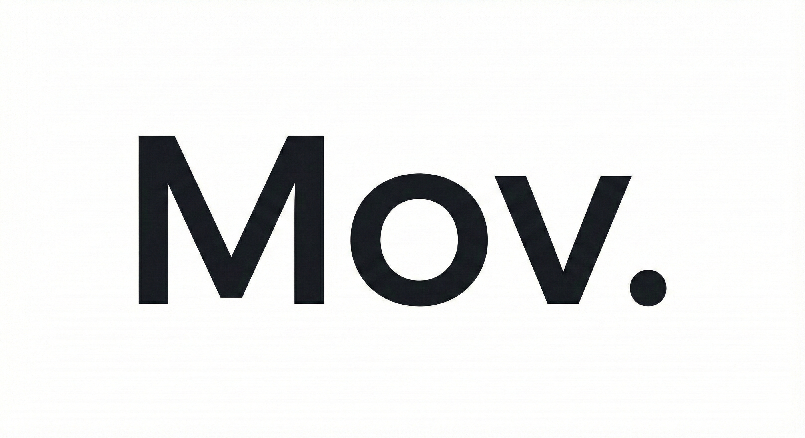

# Mov. - 미니멀리스트 블로그 템플릿

<p align="center">
  
</p>

<p align="center">
  <a href="README.md">English</a> | 한국어
</p>

Hugo와 Tailwind CSS로 제작된 깔끔하고 모던한 블로그 템플릿입니다. 명료함, 성능, 그리고 글쓰기에 대한 사랑을 담아 디자인했습니다.

*Mov. = Mono + Groove*

## 주요 기능

- **미니멀 디자인** - Playfair Display와 Inter 폰트를 활용한 깔끔한 타이포그래피
- **반응형 레이아웃** - 모든 기기에서 동작하는 모바일 퍼스트 디자인
- **빠른 성능** - Hugo를 통한 정적 사이트 생성
- **검색** - Fuse.js 기반 클라이언트 사이드 퍼지 검색
- **카테고리 필터링** - 포스트 페이지에서 카테고리별 필터링
- **날짜 정렬** - 최신순/오래된순 정렬
- **더 보기** - 홈페이지에서 포스트 점진적 로딩
- **목차** - 긴 글을 위한 자동 생성 스티키 목차
- **코드 하이라이팅** - 복사 버튼이 있는 구문 강조
- **수식 지원** - 수학 표현식을 위한 KaTeX 통합
- **콜아웃 박스** - 정보, 경고, 에러, 성공 콜아웃

## 사전 요구사항

- [Hugo](https://gohugo.io/installation/) (extended 버전 권장)
- Node.js 18+

### Hugo 설치

```bash
# macOS
brew install hugo

# Windows
choco install hugo-extended

# Linux
sudo apt install hugo
```

## 빠른 시작

```bash
# 의존성 설치
npm install

# Tailwind CSS 빌드 (첫 실행 시 필수)
npm run css:build

# 개발 서버 시작
npm run dev
```

`http://localhost:1313`에서 블로그를 확인하세요.

## 개발 명령어

| 명령어 | 설명 |
|--------|------|
| `npm install` | 의존성 설치 |
| `npm run css:build` | Tailwind CSS 빌드 |
| `npm run css:dev` | CSS 변경 감시 |
| `npm run dev` | Hugo 개발 서버 시작 |
| `npm run build` | 프로덕션 빌드 |

## 프로젝트 구조

```
├── content/
│   └── posts/           # 블로그 포스트 (Markdown)
├── data/
│   └── authors.yaml     # 작성자 정보
├── layouts/
│   ├── _default/        # 기본 템플릿
│   │   ├── baseof.html  # 베이스 HTML 템플릿
│   │   ├── single.html  # 포스트 상세 페이지
│   │   └── list.html    # 목록/아카이브 페이지
│   ├── partials/        # 재사용 컴포넌트
│   │   ├── header.html  # 검색 기능이 있는 사이트 헤더
│   │   ├── footer.html  # 사이트 푸터
│   │   ├── post-card.html
│   │   └── toc.html     # 목차
│   └── shortcodes/      # 커스텀 숏코드
├── static/
│   ├── css/main.css     # 컴파일된 CSS
│   └── js/
│       ├── main.js      # 모바일 메뉴, 스크롤 헤더
│       ├── search.js    # 검색 기능
│       ├── sort.js      # 포스트 페이지 필터/정렬
│       ├── load-more.js # 더 보기
│       ├── copy-code.js # 코드 복사 버튼
│       └── toc.js       # 목차 스크롤 추적
├── assets/
│   └── css/main.css     # Tailwind 소스
└── hugo.toml            # Hugo 설정
```

## 포스트 작성

`content/posts/`에 새 Markdown 파일을 생성하세요:

```yaml
---
title: "포스트 제목"
slug: "post-slug"
date: 2024-01-01
categories: ["Design"]
tags: ["태그1", "태그2"]
author: "author-id"
featured: true
coverImage: "https://example.com/image.jpg"
readTime: "5분 소요"
excerpt: "포스트에 대한 간단한 설명."
math: true  # KaTeX 활성화 (선택사항)
---

내용을 여기에 작성하세요...
```

### 예제: 첫 번째 포스트 추가하기

1. `content/posts/my-first-post.md` 생성:

```markdown
---
title: "나의 첫 번째 포스트"
slug: "my-first-post"
date: 2024-01-15
categories: ["Tech"]
tags: ["Blog", "Hugo"]
author: "john-doe"
featured: false
coverImage: "https://images.unsplash.com/photo-xxx"
readTime: "3분 소요"
excerpt: "Hugo로 만든 새 블로그에 오신 것을 환영합니다."
---

## Hello World

이것은 나의 첫 번째 블로그 포스트입니다. 오늘 배운 것들...

### 코드 예제

\`\`\`javascript
console.log("Hello, World!");
\`\`\`
```

2. `data/authors.yaml`에 작성자 정보 추가:

```yaml
john-doe:
  name: "홍길동"
  bio: "개발자 & 작가"
  avatar: "https://example.com/john.jpg"
```

3. 개발 서버를 시작하고 포스트 확인:

```bash
npm run dev
```

### 카테고리

카테고리는 포스트에서 사용하면 자동으로 생성됩니다. 템플릿에서 사용되는 기본 카테고리:

- `Design` - 비주얼 디자인, UI/UX 주제
- `Development` - 프로그래밍, 코드 튜토리얼
- `Lifestyle` - 개인, 생산성 주제
- `Tech` - 기술 뉴스 및 리뷰

새 카테고리를 추가하려면 포스트의 front matter에서 사용하면 됩니다:

```yaml
categories: ["Photography"]
```

카테고리가 네비게이션 필터에 자동으로 나타납니다.

## 숏코드

### 콜아웃 박스

```markdown

이것은 정보성 콜아웃입니다.

```

사용 가능한 타입: `info`, `warning`, `error`, `success`

## 커스터마이징

### 사이트 설정

`hugo.toml`을 수정하여 커스터마이징:

```toml
title = "Mov."

[params]
  blogName = "Mov."
  blogDescription = "블로그 설명"
```

### 스타일링

1. `assets/css/main.css`에서 커스텀 스타일 수정
2. 변경 후 `npm run css:build` 실행
3. Tailwind 설정은 `tailwind.config.js`에서

### 작성자

`data/authors.yaml`에 작성자 추가:

```yaml
author-id:
  name: "작성자 이름"
  bio: "짧은 소개"
  avatar: "https://example.com/avatar.jpg"
```

## 프로덕션 빌드

```bash
npm run css:build
npm run build
```

결과물은 `public/` 디렉토리에 생성됩니다.

## 접근성 (WCAG 2.2)

테마는 WCAG 2.2 Level AA를 목표로 합니다. 로드맵과 검증 방법은 `docs/accessibility/`를 참고하세요.

```bash
npm run css:build
npm run a11y
```

- [WCAG 2.2 로드맵](docs/accessibility/WCAG-2.2-ROADMAP.md)
- [작성자 가이드](docs/accessibility/AUTHOR-GUIDE.md)
- [테스트 매트릭스](docs/accessibility/TEST-MATRIX.md)

## 라이선스

MIT 라이선스

---

[Hugo](https://gohugo.io)와 [Tailwind CSS](https://tailwindcss.com)로 제작
